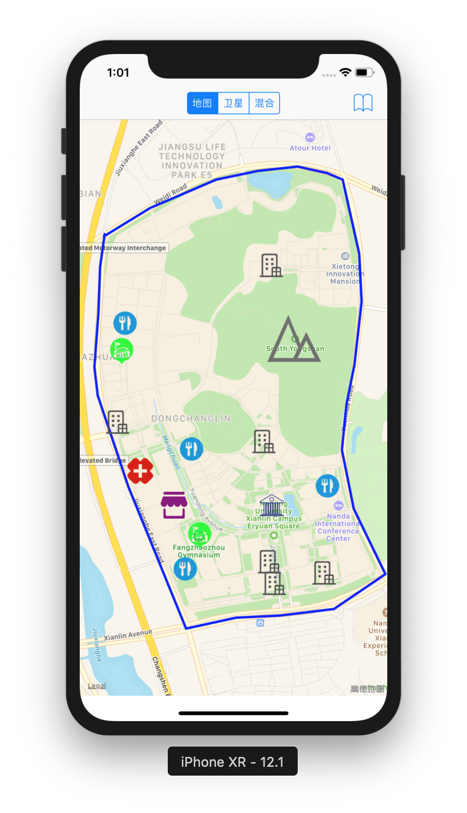
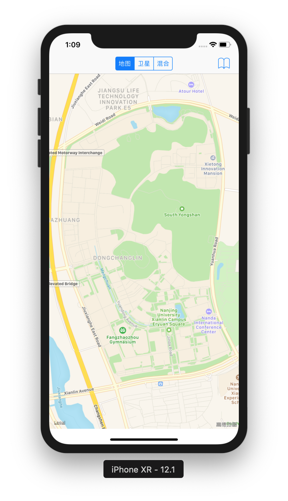
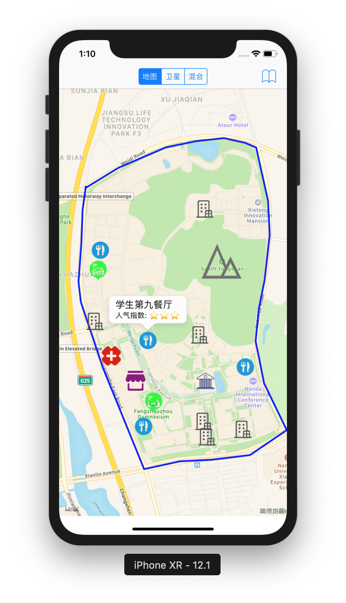

# 位置与地图

---

## 位置服务与地图

- 在应用中使用位置信息是一个将用户与周围物理世界联系在一起的非常有效的方法
  - 位置服务通过Core Location 框架提供, 提供接口让应用获取用户当前位置和朝向
  - 地图在Map Kit框架中提供，支持地图的显示和地图标记

---

## 概览 

- 定位服务（Location Services）提供地理位置信息
  - iBeacon技术增强了用户定位（室内定位）
  - Heading 信息显示用户当前朝向
  - 地图支持导航和地理位置相关信息显示
  - 本地搜索

---

## 获取用户当前位置

- 可使用多种服务
  - 地理位置显着变化服务：提供了一种低功耗的方式来获得当前位置，并在发生重大变化时通知。
  - 标准位置服务：提供了一个高度可配置的获得当前位置和追踪位置变化的服务。
  - 区域监测：监测是否出入定义的地理位置区域和蓝牙低功耗信标（Beacon）地区。

---

## 首先：判断定位服务是否可用
- 不可用情况
  - 用户禁用定位功能
  - 设备处于飞行模式或无法启动某硬件
  - 用户拒绝了应用的定位权限授权

<small>因此需要在尝试获取标准或显著变化位置服务前，首先调用`CLLocationManager` 的`locationServicesEnabled`方法</small>

---

## 示例

https://github.com/idupclub/WhereAmI

---

能耗考虑

- 指定合适的精度要求 
- 确保`pausesLocationUpdatesAutomatically` 属性设为`YES`
- ...

---

## 显示地图

- Map Kit 框架让开发者可以在应用中潜入一个功能完整的地图

<!-- - 使用MapKit需要在Xcode工程中打开“Maps能力（capability） -->

---

## MKMapView
- 显示地图数据
- 管理用户交互
- 显示应用定制的内容

---

## Map Delegate

- 提供响应Map视图事件的方法
  - 地图可视区域的改变事件
  - 从网络上下载地图内容块（tiles）的事件
  - 用户位置变化事件
  - 与地图标注和层相关的变化事件

---

## 实践

 <!-- .element height="50%" -->

https://github.com/idupclub/CampusMap

---

## 第一步：显示地图

 <!-- .element height="50%" -->

---

## 第二步：图层和标注

 <!-- .element height="50%" -->

---

## 第三步：位置与导航

作业

---

## 参考文档

[Location and Maps Programming Guide](https://developer.apple.com/library/ios/documentation/UserExperience/Conceptual/LocationAwarenessPG/Introduction/Introduction.html)

---
## The End